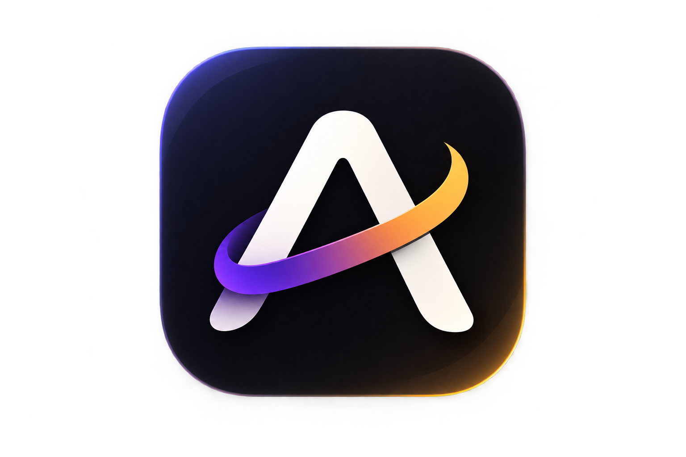

<div align="center">
  

  # Aura
  **A Local-First, Mindful Productivity Application for Desktop**

  <p>
    A privacy-focused desktop productivity suite engineered for deep work, intentional task management, and offline reliability. Built without cloud dependencies, external trackers, or subscription locks.
  </p>

  <p>
    <a href="#overview">Overview</a> •
    <a href="#key-features">Key Features</a> •
    <a href="#architecture--tech-stack">Tech Stack</a> •
    <a href="#getting-started">Getting Started</a> •
    <a href="#keyboard-shortcuts">Shortcuts</a> •
    <a href="#privacy--security">Privacy</a> •
    <a href="#license">License</a>
  </p>

  <p>
    
    
    
    
    
    
  </p>
</div>

---

## Overview

Aura is a desktop productivity system designed to minimize context switching and cognitive fatigue. Unlike conventional project management software that relies on remote databases, telemetry, and background services, Aura operates entirely on your local machine.

By combining natural language processing, system-level global hotkeys, offline audio synthesis, and customizable widget systems, Aura provides a seamless workflow for individual planning, execution, and daily reflection.

---

## Key Features

### Global Quick Capture
Access the input system from any application using system-wide hotkeys (`Ctrl+Shift+Space`). Capture ideas, assign tags, or schedule deadlines without breaking your active workflow.

### Natural Language Syntax
Tasks can be defined using inline shorthand syntax that is automatically parsed in real time:

```text
Prepare financial report by friday @finance #Work !
Follow up on system architecture every 2 weeks @engineering
Schedule medical appointment in 3 days @health
```

| Token | Description | Example |
|---|---|---|
| `!` | Flags the task as urgent / high priority | `Complete deployment !` |
| `@tag` | Assigns an indexed, filterable tag | `@design`, `@backend` |
| `#Category` | Categorizes the item into a project or area | `#Work`, `#Personal` |
| `by <time>` | Resolves relative deadlines and dates | `by friday`, `by 5pm` |
| `every <interval>` | Configures recurrent scheduling | `every day`, `every monday` |

### Intentional Planning & Daily Rituals
- **Morning Intention:** Select up to three Most Important Tasks (MITs) to anchor daily focus.
- **Capacity Budgeting:** Estimate task durations to avoid exceeding sustainable daily capacity thresholds.
- **Evening Review:** End-of-day reflection flow with automated notifications to log accomplishments and maintain progress logs.

### Deep Work & Ambient Sound Synthesis
- **Focus Timer:** Customizable Pomodoro and interval work sessions.
- **Distraction Logging:** Quick-log intrusive thoughts or tangents without terminating active focus intervals.
- **Procedural Ambient Sound:** Pure local sound synthesis (Pink Noise, Brown Noise, White Noise) powered by Tone.js without streaming audio or downloading assets.

### Extensible Plugin & Widget Engine
- **Customizable Dashboard:** Modular widget canvas supporting drag-and-drop, layout persistence, and dynamic state bindings.
- **Plugin Registry:** Clean API to extend functionality, views, and data processing routines.

### Voice Capture & Audio Notes
Record voice memos directly inside tasks. Integrated audio visualizer and local audio storage keep all recordings structured and easily accessible.

### Native Filesystem Integration
Attach local files (`.pdf`, `.docx`, images, source code) by dragging and dropping them into tasks. Attachments are securely organized within the local application storage directory and can be opened directly in default operating system handlers.

### The Grove
A visual representation of productivity where task completion contributes to a sustainable digital ecosystem, offering non-gamified feedback on task execution.

---

## Architecture & Tech Stack

```
+------------------------------------------------------------------+
|                       Aura Desktop Shell                         |
|                         (Electron 43)                            |
+------------------------------------------------------------------+
|                   User Interface Layer (React 18)                |
|  - Zustand State Stores (Tasks, UI, Widgets, Plugins)            |
|  - Framer Motion Layout Animations & Transitions                 |
|  - Tailwind CSS v4 Design Tokens & Responsive Utilities          |
|  - Tone.js Local Audio Synthesis Engine                          |
+------------------------------------------------------------------+
|                    Local Storage & Integration                   |
|  - Native Filesystem Access (AppData / Local Config)             |
|  - Automated 30-Day Rolling JSON Snapshots                       |
|  - Offline SQLite / IndexedDB State Persistence                  |
+------------------------------------------------------------------+
```

### Core Technologies

| Layer | Technology | Purpose |
|---|---|---|
| Runtime | [Electron](https://www.electronjs.org/) | Desktop window management, IPC communication, and OS integration |
| Frontend | [React 18](https://react.dev/) | Component hierarchy, virtual rendering, and UI synchronization |
| Build Tool | [Vite 6](https://vitejs.dev/) | Fast HMR development server and optimized bundle generation |
| State Management | [Zustand 5](https://github.com/pmndrs/zustand) | Decoupled, high-performance client state management |
| Audio Engine | [Tone.js](https://tonejs.github.io/) | Web Audio API wrapper for browser-synthesized focus noise |
| Virtualization | [@tanstack/react-virtual](https://tanstack.com/virtual) | Performant rendering for long lists and extensive data views |
| Testing | [Vitest](https://vitest.dev/) & [Testing Library](https://testing-library.com/) | Unit, component, and user journey integration tests |

---

## Getting Started

### Prerequisites
- **Node.js**: Version 18.0 or higher
- **npm**: Version 9.0 or higher

### Installation

1. Clone the repository:
   ```bash
   git clone https://github.com/CodeSorcerer-007/Aura.git
   cd Aura
   ```

2. Install dependencies:
   ```bash
   npm install
   ```

3. Launch development environment:
   ```bash
   # Starts Vite development server and Electron shell
   npm run electron:dev
   ```

### Production Build

Compile the web application and package native desktop executables:

```bash
# Production bundle and platform-specific installer packaging
npm run electron:build
```

Packaged installers and standalone binaries will be placed in the `release/` directory.

### Running Test Suites

Execute unit and integration tests using Vitest:

```bash
npm test
```

---

## Keyboard Shortcuts

| Shortcut | Scope | Action |
|---|---|---|
| `Ctrl + Shift + Space` | Global (OS) | Summon Quick Capture overlay from any application |
| `N` | Application | Focus the primary task capture input |
| `/` | Application | Open the Command Palette |
| `S` | Application | Open Application Settings |
| `1` - `6` | Application | Switch active views (Flow, Calendar, Projects, Grove, Journal, Review) |
| `Escape` | Application | Dismiss active modal or overlay |

---

## Privacy & Security

- **Strictly Offline**: Aura does not make outbound network calls, transmit analytics, or communicate with remote servers.
- **Local Data Sovereignty**: All application data, configurations, and attachments reside strictly within local user directories (`%APPDATA%\Aura` on Windows, `~/Library/Application Support/Aura` on macOS, `~/.config/Aura` on Linux).
- **Automated Rolling Backups**: Configurable daily JSON backups are written directly to your local documents directory, enabling version recovery without third-party services.
- **Zero Third-Party Tracking**: No telemetry SDKs, crash report collectors, or behavioral analysis tools are bundled with the software.

---

## Contributing

Contributions to Aura are welcome. When submitting contributions, please follow these guidelines:

1. Fork the repository and create a feature branch (`git checkout -b feature/new-capability`).
2. Verify all test suites pass (`npm test`).
3. Maintain TypeScript typings and project code formatting standards.
4. Commit changes with clear, descriptive messages.
5. Open a Pull Request detailing the changes and technical context.

---

## License

This project is licensed under the [MIT License](LICENSE).
