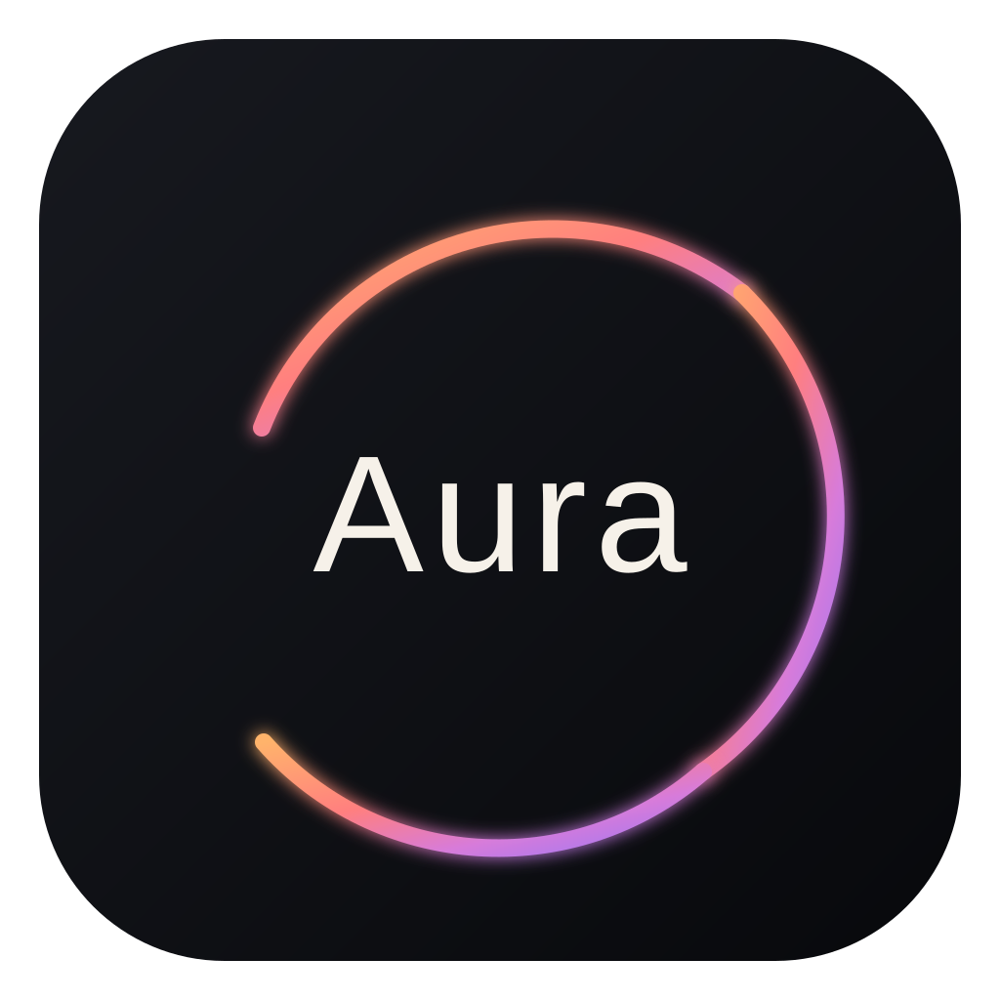

<div align="center">
  

  # Aura — Native Android
  **A 100% Native, Mindful Productivity Application for Android (Jetpack Compose & Kotlin)**

  <p>
    A privacy-first, mindful productivity app engineered for deep focus, intentional planning, and daily reflection. Built with zero web wrappers, zero telemetry, and pure offline reliability.
  </p>

  <p>
    
    
    
    
    
  </p>
</div>

---

## Key Highlights

- **100% Native Performance**: Built ground-up in Jetpack Compose, completely eliminating Capacitor/Electron WebView bottlenecks and layout collapse defects.
- **5 Mindful Views**:
  - **Flow**: Mindful time-of-day task organization (*Morning*, *Afternoon*, *Evening*, *Night*, *Someday*), *Pinned* high-priority focus tasks, and collapsible completed history.
  - **Projects (Constellations)**: Interactive graph visualizing project categories as central stars connected to satellite task nodes with template saving and loading.
  - **Grove**: Procedural tree growth canvas fueled by completed tasks, golden seed bank, and unlocked productivity achievements.
  - **Journal**: Daily reflection prompts (*"What went well today?"*, *"What am I grateful for?"*), markdown notes, and daily completion logs.
  - **Review**: 52-week productivity heatmap (GitHub-style activity grid), current streak counter, category distribution breakdown, and audit of older tasks (*Unfinished Business*).
- **Natural Language Parsing**: Full inline command detection for recurrence (`daily`, `weekly`, `weekdays`, `monthly`, `every X days`), categories (`@work`, `@personal`), tags (`#urgent`, `#reading`), priorities (`!`, `!!`, `!!!`), and deadlines (`by friday`, `due tomorrow`).
- **Offline Procedural Audio Engine**: Real-time PCM synthesis using `AudioTrack` generating pure sine waves, bell chimes, binaural beats, and Pink/Brown/White noise without external audio files.
- **16 Dynamic Themes & Custom Theme Creator**: Full palette engine including *OLED Dark, Clean Light, Cyberpunk, Crimson, Forest, Ocean, Dune, Sakura, Solarized, Dracula, Nord, Gruvbox, Monokai, Rosé Pine, Matcha, Latte*, plus custom theme creation and live animated canvas backgrounds.
- **Privacy & Storage Access Framework (SAF)**: Full backup export and import to JSON, and document attachments via native Android document pickers.

---

## Tech Stack & Requirements

| Specification | Details |
| :--- | :--- |
| **Language** | Kotlin 2.0.21 |
| **UI Framework** | Jetpack Compose (BOM 2024.09.00), Material 3 |
| **Local Database** | Embedded SQLite (`AuraDbHelper`) |
| **Preferences** | Android `SharedPreferences` |
| **Audio Engine** | Android `AudioTrack` (Real-time PCM synthesis) |
| **Min SDK** | Android 8.0 (API 26) |
| **Target SDK** | Android 16 (API 36) |
| **Build System** | Gradle 8.11.1, Android Gradle Plugin 8.7.2 |

---

## Project Structure

```text
Aura/
├── aura-android/                  # Native Android project
│   ├── app/
│   │   ├── src/main/java/com/example/aura/
│   │   │   ├── audio/             # Real-time PCM audio synthesis
│   │   │   ├── data/
│   │   │   │   ├── local/         # SQLite database & SharedPreferences
│   │   │   │   ├── model/         # Task, Theme, and App data models
│   │   │   │   └── parser/        # Natural language task parser
│   │   │   ├── notifications/     # Notification manager
│   │   │   ├── ui/
│   │   │   │   ├── components/    # Custom line icons, dock, header, cards
│   │   │   │   ├── main/          # MainActivity, MainScreen, ViewModel
│   │   │   │   ├── modals/        # Modals (Settings, Details, Audio, Search)
│   │   │   │   ├── theme/         # 16 animated canvas backgrounds & tokens
│   │   │   │   └── views/         # 5 core views (Flow, Projects, Grove, Journal, Review)
│   │   │   └── AndroidManifest.xml
│   │   └── build.gradle.kts
│   ├── gradle/
│   ├── build.gradle.kts
│   ├── settings.gradle.kts
│   └── gradlew.bat
├── aura1.js                       # Original reference web app source
├── Aura_Native_Android_Migration_Master_Prompt.md
└── README.md
```

---

## Getting Started

### Prerequisites
- Android Studio Ladybug (2024.2.1+) or newer
- JDK 17 or JDK 21
- Android SDK Platform 36 (or API 34+)

### Build & Run via Command Line

1. Navigate to the Android project directory:
   ```bash
   cd aura-android
   ```

2. Build the debug APK:
   ```bash
   ./gradlew assembleDebug
   ```
   *(On Windows PowerShell: `.\gradlew.bat assembleDebug`)*

3. Install onto a connected device or emulator:
   ```bash
   adb install -r app/build/outputs/apk/debug/app-debug.apk
   ```

4. Launch the application:
   ```bash
   adb shell am start -n com.example.aura/.MainActivity
   ```

---

## License

This project is open-source under the [MIT License](LICENSE).
