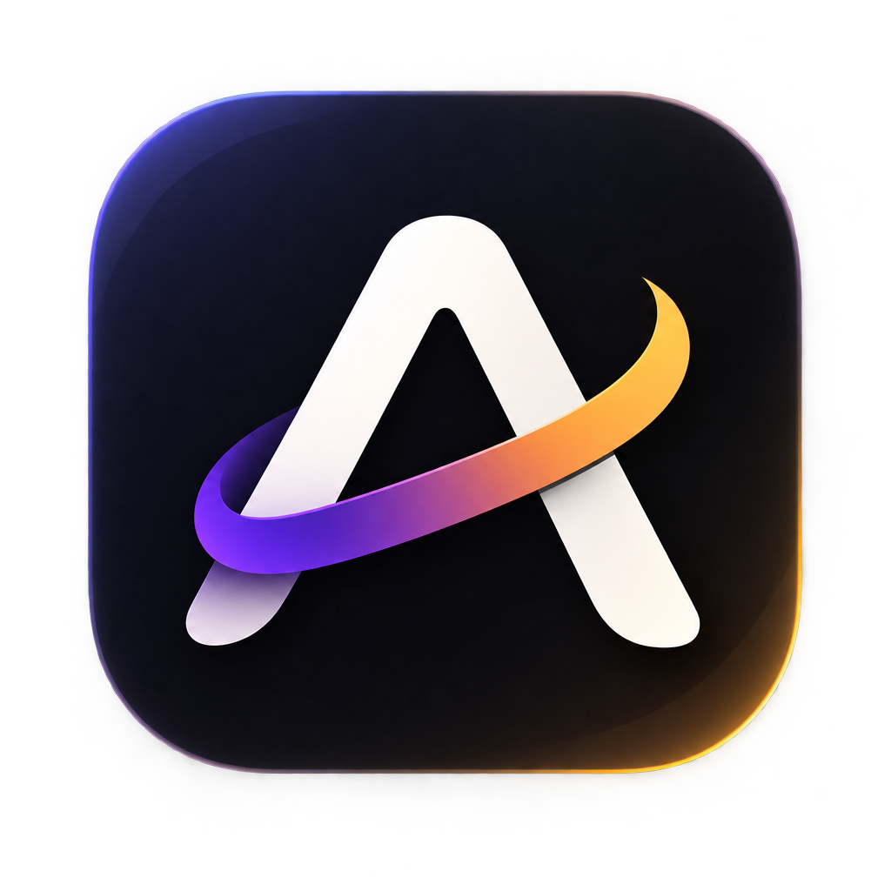

<div align="center">
  
  
  # 🌿 Aura
  **Mindful Productivity**

  <p>
    A privacy-first, fully offline productivity app that lives on your desktop.<br/>
    No subscriptions. No cloud. No server. Just you and your tasks.
  </p>

  <p>
    <a href="#-features">Features</a> •
    <a href="#-installation">Installation</a> •
    <a href="#-tech-stack">Tech Stack</a> •
    <a href="#-privacy">Privacy</a>
  </p>
  
  
  
  
  
</div>

<br/>

## ✨ Features

### 📋 Smart Task Capture
Type tasks naturally — Aura understands you. Hit `N` to open the capture bar anywhere.

```text
Design the landing page by friday @work !
Submit report every week #Work
Call dentist in 2 weeks @health
Plan sprint Q3
Finish proposal end of month
```

<div align="center">

| Syntax | What it does |
|:---:|:---|
| `!` | Sets task as urgent (high priority) |
| `@tag` | Adds a searchable tag |
| `#Category` | Assigns a category |
| `by friday` | Sets a deadline to the upcoming Friday |
| `every day` | Creates a recurring task |
| `Q1` / `Q3` | Sets deadline to end of that quarter |

</div>

---

### 🌿 The Grove
Your tasks grow into a visual garden. Complete tasks → plant seeds → watch your Grove flourish with trees, flowers, and glowing orbs. A mindful, non-gamified way to see your progress.

### ⏱️ Focus Timer
Built-in Pomodoro-style focus timer with ambient background noise:
* 🌸 Pink noise | 🌊 Brown noise | 💨 White noise
* Fully offline — powered by the **Tone.js** synthesis engine.

### 📓 Journal & Reflection
Daily reflection journal with prompts tied to your task momentum and completed wins.

### 🎨 Themes & Customization
Choose from gorgeous, glassmorphic presets or build your own:
* 🌑 **Dark** — sleek deep black
* 🍒 **Crimson** — bold and energetic
* 🌸 **Sakura** — soft and calm
* ✨ **Custom Themes** — create your own bespoke color palette

---

## 🚀 Installation

### Option A: One-Click (Windows)
```bash
git clone https://github.com/your-username/aura.git
cd aura
# Double-click install.bat
```
*The script installs dependencies, builds the app, and launches it. You never need to open a terminal again.*

### Option B: macOS / Linux
```bash
git clone https://github.com/your-username/aura.git
cd aura
chmod +x install.sh
./install.sh
```

### Option C: Developer Mode
```bash
git clone https://github.com/your-username/aura.git
cd aura
npm install
npm run dev
```

<br/>

## 📱 Install as a PWA (Offline Desktop App)

Aura is a full **Progressive Web App (PWA)**. Once installed:

- ✅ **Completely Offline** — no internet connection ever required.
- ✅ **Native Feel** — appears in your Start Menu / Dock like a native app.
- ✅ **Borderless Window** — uses Window Controls Overlay for a native UI.
- ✅ **Local Data** — all data stays 100% on your device in IndexedDB.

> To install from Chrome/Edge/Brave: look for the **install icon (⊕)** in the address bar after running the app.

<br/>

## 🏗️ Tech Stack

| Technology | Purpose |
|---|---|
| **[React 18](https://react.dev/)** | Core UI framework |
| **[Zustand](https://zustand-demo.pmnd.rs/)** | Ultra-fast, modular state management |
| **[Tailwind CSS v4](https://tailwindcss.com/)** | Utility-first styling |
| **[Framer Motion](https://www.framer-motion.com/)** | Liquid-smooth animations & drag-and-drop |
| **[Tone.js](https://tonejs.github.io/)** | Local audio synthesis for focus noise |
| **[@tanstack/virtual](https://tanstack.com/virtual)** | Virtualized task list for massive datasets |
| **[Vite PWA](https://vite-pwa-org.netlify.app/)** | Service Worker, precaching, & offline routing |

<br/>

## 🔒 Privacy

- 🚫 **Zero telemetry.** No analytics, no tracking, no crash reporting.
- 🚫 **Zero network requests** after the initial build (fully offline).
- 💾 **All data lives in your browser's IndexedDB.** It never leaves your device.
- 📁 **Automated Local Backups.** Seamlessly write silent JSON backups to your file system.

<br/>

## ⌨️ Keyboard Shortcuts

| Key | Action |
|:---:|:---|
| <kbd>N</kbd> | New task (focus capture bar) |
| <kbd>S</kbd> | Open settings |
| <kbd>/</kbd> | Open command palette |
| <kbd>1</kbd> - <kbd>5</kbd> | Switch between views (Flow, Grove, Journal, Projects, Review) |
| <kbd>Escape</kbd> | Close any open modal |

<br/>

---

<div align="center">
  <p>Made with 🌿 for people who believe productivity should feel calm.</p>
  <a href="https://opensource.org/licenses/MIT">
    
  </a>
</div>
